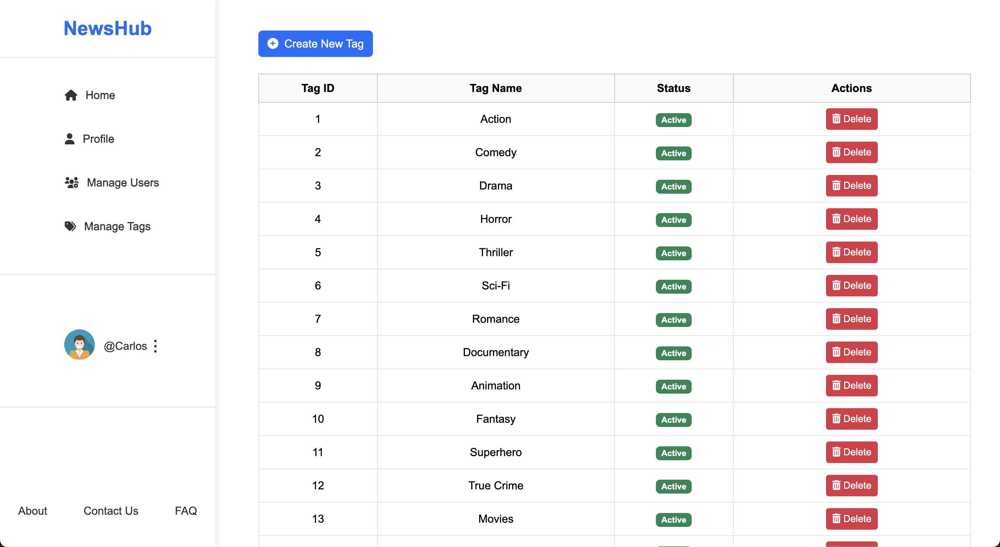

# Lbaw24142

# NewsHub

To transform how movie and TV enthusiasts discover information, share news, and connect with one another, aiming to become the largest collaborative platform for entertainment lovers to engage and stay updated with the latest entertainment news.

Our platform, NewsHub, is a dynamic website designed for fans of movies, series, and all things entertainment. Inspired by the functionality of Reddit, NewsHub enables users to post news and updates, interact through comments, likes, and replies, and foster a vibrant community of movies enthusiasts that feel the urge to express themselves. With a modern design and robust features, NewsHub is the go-to hub for discussing the latest trends, sharing opinions, and connecting with like-minded individuals.

Whether you're a casual viewer or a dedicated cinephile, NewsHub offers an engaging space where every opinion counts and every interaction builds a stronger community.

NewsHub brings fans of movies and series together like never before! Designed for dynamic interaction, our platform lets users share, discuss, and explore everything in the entertainment world. Users can post, edit, and delete news, follow movie genres through tags, and engage with others by commenting, liking, and following. With real-time notifications for likes, comments, and follows, and a trending page that highlights the hottest and most talked about movies powered by the TMDB API, NewsHub keeps you up-to-date with what’s buzzing in cinemas and beyond. Top influencers stand out visually, and admins maintain a safe and engaging community with robust moderation tools.

Built on cutting-edge technology, NewsHub combines PHP and the Laravel Framework for backend development, JavaScript for interactivity, and Bootstrap for responsive design. HTML5, CSS, and FontAwesome ensure a modern, visually appealing layout, while AJAX delivers a smooth browsing experience. Whether you're exploring content or engaging with the community, NewsHub is your go-to platform for entertainment enthusiasts.

## NewsHub Overview

### Home


### Follows


### Trending Movies


### Notifications


### Admin Feature to Manage Users


### Admin Feature to Manage Tags




## Project Components

* [ER: Requirements Specification](https://github.com/luizhqueiroz/LBAW-NewsHub/wiki/er)
* [EBD: Database Specification](https://github.com/luizhqueiroz/LBAW-NewsHub/wiki/ebd)
* [EAP: Architecture Specification and Prototype](https://github.com/luizhqueiroz/LBAW-NewsHub/wiki/eap)
* [PA: Product and Presentation](https://github.com/luizhqueiroz/LBAW-NewsHub/wiki/pa)

## Product

The final version of the source code is now available in the group's Git repository. You can access it [here](https://github.com/luizhqueiroz/LBAW-NewsHub).

The Docker image is available at the group's GitLab Container Registry using the production database and can be run with:

```code
docker run -d --name lbaw24142 -p 8001:80 gitlab.up.pt:5050/lbaw/lbaw2425/lbaw24142
```

### User Credentials

| Type | Username | Password |
|------|----------|----------|
| basic account | movie_buff91@example.com | 123456 |
| news editor | movie_buff91@example.com | 123456 |
| comment editor | movie_buff91@example.com | 123456 |
| influencer | tv_series_queen@example.com | 123456 |
| admin | carlos@example.com | adm123 |

## Team

* João Victor Botelho Duarte, up202102361@up.pt
* Luiz Henrique Mamede Queiroz, up202102362@up.pt
* Raphael Moragas Dias Taveira Gonçalves, up202103338@up.pt
* Victor Duarte Frauzino Lima de Matos, up202102358@up.pt

***
GROUP24142, 26/09/2024
